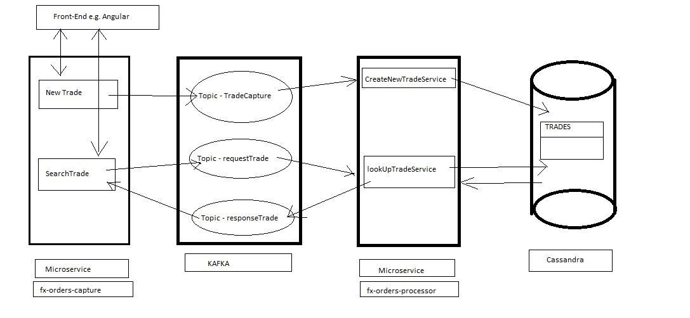
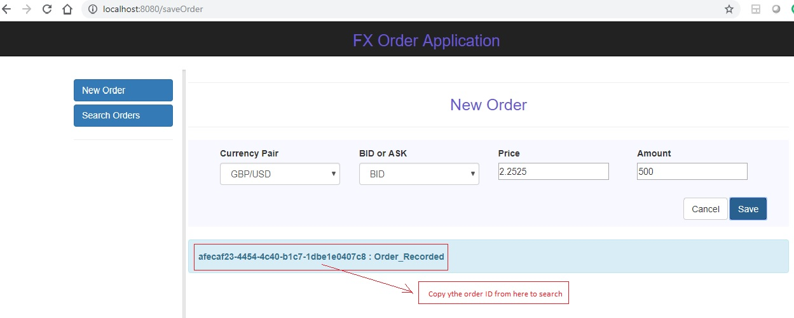
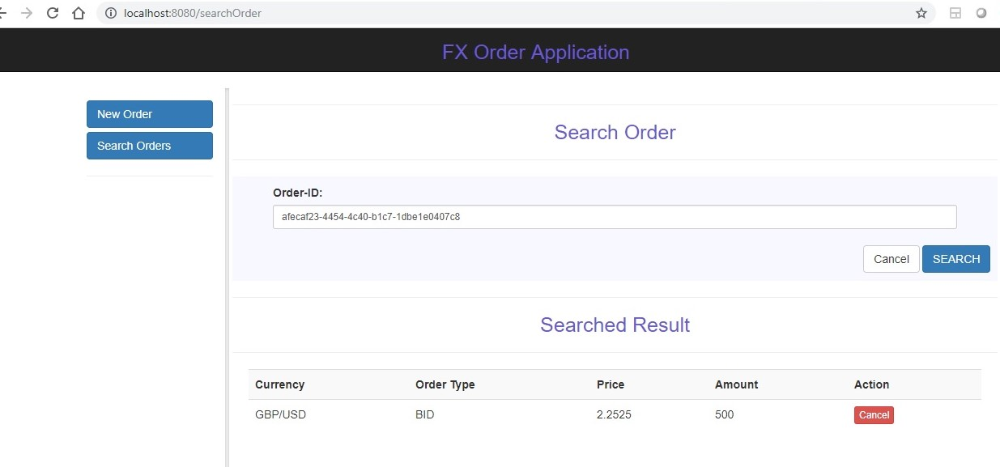

# fx-orders-processor - Overview

This is part of a data service project that uses java spring microservice (fx-orders-processor and fx-orders-capture), kafka, cassandra. The microservice fx-orders-capture captures a hypothetical forex trade from front-end and publishes it to kafka topic (tradeCapture) and waits for an acknowledgement for upto 5 seconds. It also has a trade search function that uses kafka as a request-reply (simulated syncronous) bridge to publish a trade search request to kafka request topic (tradeRequest) and retrieves the trade response from response topic (tradeReply) and displays on the front-end.

The microservice - fx-orders-processor process the trade by reading from kafka topic (tradeCapture) and inserts into a cassandra table (orders) under keyspace traderecords. It also reads a trade search request from topic (tradeRequest) and retrieves the trade from cassandra table (orders) and publishes that trade to response topic (tradeReply).

This microservice work together with another microservice https://github.com/pmjobsearch01/fx-orders-capture.git

# This microservice (fx-orders-processor) is responsible for 

* to read a trade from kafka topic (tradeCapture) and insert into cassandra table (orders)
* to read a trade ID from kafka topic (tradeRequest) 
* return a response to kafka topic (tradeReply) by looking-up from cassandra table (orders)

## Overall architecture

## Basic configuration

The basic configuration are as below

## Start Zookeeper
* Download zookeeper from http://zookeeper.apache.org/releases.html#download and extract it to local drive. 
* Rename “zoo_sample.cfg” to “zoo.cfg” inside config directory (for windows machines only). 
* Also edit dataDir entry inside zoo.cfg to a valid path e.g. \zookeeper\data (for windows machines only).
* Ensure you have java installed and JAVA_HOME is set in the system environment variable (for windows machines only). 
* Add ZOOKEEPER_HOME environment variable before bin path of your zookeeper directory (for windows machines only)
* Add ;%ZOOKEEPER_HOME%\bin; to PATH variable (for windows machines only)

- `double click bin/zkServer.cmd` (windows)
- `bin/zookeeper-server-start.sh config/zookeeper.properties` (UNIX)

## Start Kafka Server
* Download kafka from https://kafka.apache.org/
* Extract it and edit “server.properties” inside config folder
* Change log.dirs to a valid path e.g. (windows) “=C:\\kafka\\kafka-logs”
* Open a dos shell and go inside kafka bin directory e.g. cd C:\kafka\kafka_2.11-1.0.0\bin\windows

- `kafka-server-start.bat ../../config/server.properties` (UNIX)
- `bin/kafka-server-start.sh config/server.properties` (UNIX)

## Create Kafka Topic
- `kafka-topics.bat --create --zookeeper localhost:2181 --replication-factor 1 --partitions 1 --topic tradeCapture` (Windows)

- `kafka-topics.bat --create --zookeeper localhost:2181 --replication-factor 1 --partitions 1 --topic tradeRequest` (Windows)

- `kafka-topics.bat --create --zookeeper localhost:2181 --replication-factor 1 --partitions 1 --topic tradeReply` (Windows)

- `kafka-topics.sh --create --zookeeper localhost:2181 --replication-factor 1 --partitions 1 --topic tradeCapture` (UNIX)

- `kafka-topics.sh --create --zookeeper localhost:2181 --replication-factor 1 --partitions 1 --topic tradeRequest` (UNIX)

- `kafka-topics.sh --create --zookeeper localhost:2181 --replication-factor 1 --partitions 1 --topic tradeReply` (UNIX)

## Start Cassandra
* dwonload cassandra from http://cassandra.apache.org/download/
* Extract it to local drive
* Run the installer and leave everything default
* Go to cassandra installation directory inside bin folder

- `double click on cassandra.bat` (Windows)
- `run equivalent shell script in unix` (UNIX)

* If you would like to verify data inside cassandra table then you have to install python and set PYTHON_HOME environment variable.
* Once you open a cassandra client shell you can use these commands use traderecords; select * from orders;

## By default cassandra will run on port 9042 and Kafka will run on port 9092 and Apache Zookeeper will run on port 2181. If you change any of these default setting then accordingly update microservice properties inside resource folder.

JUnit Test
------------------

If you have git-bash installed and configured in the path then use below command to checkout source code into your system,

git clone https://github.com/pmjobsearch01/fx-orders-processor.git

If you have maven installed and in the path then use below command to build and run junit test cases that proves the core functions,

Go to the folder where the code is checked-out (you should see the pom.xml in your current folder)

cd fx-orders-processor

mvn clean install

Run Application
--------------------------
mvn spring-boot:run

Test from Browser (GUI)
-------------------------
We also require fx-orders-capture microservice https://github.com/pmjobsearch01/fx-orders-capture.git to run along with fx-orders-processor microservice.

Once both of the applications are up and running by using above run command open a browser and test the application using below url

http://localhost:8080/

You may contact me for professional consulation around an issue or enhancement e.g. adding docker containers or additional functional or non-functional aspects or request-response tuning etc. partha.contact@gmail.com 
